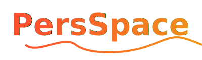

PersSpace (Personal Space) ist ein persönlicher Hub, um sich selbst zu organisieren. Dabei sollen die Nutzer in der Lage sein, eigene Ereignisse (Events) anzulegen und sich diese anzeigen zu lassen. Hierbei bietet die Applikation verschiedene Arten von Events an.

## Funktionen (teils noch nicht implementiert)

-   Nutzerlogin und -registrierung via Google Login (Social Login)
-   Events:
    -   anlegen
    -   editieren
    -   löschen
    -   anzeigen
-   Übersichten:
    -   alle Events
    -   letzte Events
    -   Kalenderübersicht
    -   Diagramme

## Technologien

In diesem Projekt werden folgende Technologien genutzt.

### Frontend

-   Angular 20 mit Server-Side-Rendering (SSR)
-   Google Login (Social Login) via Google Render Button

### Backend

-   C# mit APS .NET Core (v9)
-   Validierung des Google-Tokens
-   Verwaltung der Session mit Access- und Refresh-Tokens

### Datenbank

-   PostgreSQL via Backend erreicht
